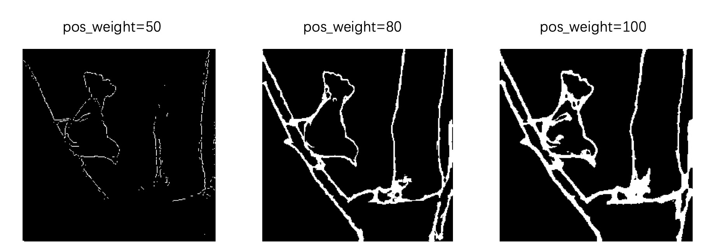
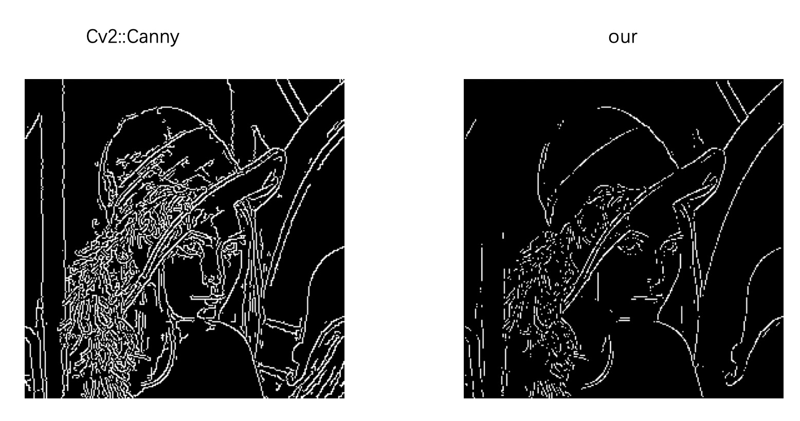

### keras实现,使用生成对抗网络检测物体边缘检测

* 使用预训练的VGG16作为基础网络.
* 使用canny边缘检测算子生成大量边缘图像作为训练集.
### 问题：
 *对于边缘检测，使用了标准的二值交叉熵损失函数. 获得边缘检测能力之后，尝试推广到BSDS轮廓分割数据集，此轮廓分割数据集具有正负样本极不平衡的特点. 二值交叉熵函数无效，网络输出全为背景. 使用focal loss时生成器损失迅速变为nan. 类间平衡交叉熵函数无效. 使用加权交叉熵损失时，效果明显提升，难点在于权重的设置*

但总体效果不佳，未继续优化.

### canny 边缘检测

